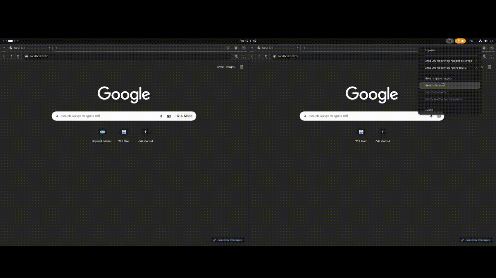

# Stage_3_SpringBootMicroservicesBank

## *EN*
#### Project to demonstrate the capabilities of developing a microservice application using Spring Boot, organizing configuration management via Spring Boot Cloud, ensuring security via Spring Security and Keycloak, deploying using k8s via the Helm package manager, and messaging using Kafka
#### Tech stack: Spring Framework, Spring Boot, PostgreSQL, HTML, Thymeleaf, Spring Web, Spring Data JPA, Spring Cloud, RESTful API, Spring Security, Keycloak, Docker, k8s (Rancher Desktop), Helm, Kafka

### Application features:
    - user editing of their data
    - simulated user withdrawals/deposits
    - transfer of funds to another user

### Application deployment:
    NOTE: ports for Keycloak and the user application must be > 30000, because in K8s uses NodePort
    - Before you begin, you'll need:
            - Java (JRE) (version 21 was used during project development)
            - K8s (Rancher Desktop)
            - Helm
    1. Using an IDE (IntelliJIdea was used during project development):
            - clone the repository
            - open the project in the IDE
            - run the Docker image build script: ./my-script-to-build-docker-images.sh
            - run K8s (Rancher Desktop)
            - install the project's Helm chart: helm install bank-chart ./bank-chart/
            - check via kubectl that all pods are running: kubectl get pods
            - open a browser at http://localhost:30080/
            - the Keycloak admin panel will open
            - create users according to schema.sql from bank-account-service/bank-cash-service
            - assign them the appropriate roles/permissions
            - open a browser at http://localhost:30005/
            - the application's start page will open
       2. Without an IDE
            - clone the repository
            - run the Docker image build script: ./my-script-to-build-docker-images.sh
            - launch k8s (Rancher Desktop)
            - install the project's Helm chart: helm install bank-chart ./bank-chart/
            - check via kubectl that all pods are running: kubectl get pods
            - open a browser at http://localhost:30080/
            - the Keycloak admin panel will open
            - create users according to the schema.sql file from bank-account-service/bank-cash-service
            - assign them the appropriate roles/permissions
            - open a browser at http://localhost:30005/
            - the application's start page will open

## *RU*
#### Проект для демонстрации возможностей разработки с использованием Spring Boot микросервисного приложения, организации управления конфигурациями через Spring Boot Cloud, обеспечения безопасности через Spring Security и Keycloak, деплоя с помощью k8s через пакетный менеджер Helm и предачи сообщений с помощью Kafka
#### Технологический стек: Spring Framework, Spring Boot, PostgreSQL, HTML, Thymeleaf, Spring Web, Spring Data JPA, Spring Cloud, RESTful API, Spring Security, Keycloak, Docker, k8s (Rancher Desktop), Helm, Kafka

### Возможности приложения:
    - редактирование пользоватлем своих данных
    - имитация снятия/пополнения пользователем своего баланса
    - перевод средств другому пользователю

### Развертывание приложения:
    ЗАМЕТКА: порты для Keycloak и пользовательского приложения должны быть > 30000, т.к. в k8s используется NodePort
    - Перед началом работы необходимы:
            - Java (JRE) (при разработке проекта использовалась версия 21)
            - k8s (Rancher Desktop)
            - Helm
    1. Через IDE (при разработке проекта использовалась IntelliJIdea):
            - клонировать репозиторий
            - открыть проект в IDE
            - запустить скрипт сборки docker-образов: ./my-script-to-build-docker-images.sh
            - запустить k8s (Rancher Desktop)
            - установить Helm-чарт проекта: helm install bank-chart ./bank-chart/
            - проверить через kubectl что все поды подняты: kubectl get pods
            - зайти в браузер по адресу http://localhost:30080/
            - откроется admin-панель Keycloak
            - создать пользователей в соответствии с schema.sql из bank-account-service/bank-cash-service
            - назначить им соответствующие роли/права
            - зайти в браузер по адресу http://localhost:30005/
            - откроется стартовая страница приложения
    2. Без использования IDE
            - клонировать репозиторий
            - запустить скрипт сборки docker-образов: ./my-script-to-build-docker-images.sh
            - запустить k8s (Rancher Desktop)
            - установить Helm-чарт проекта: helm install bank-chart ./bank-chart/
            - проверить через kubectl что все поды подняты: kubectl get pods
            - зайти в браузер по адресу http://localhost:30080/
            - откроется admin-панель Keycloak
            - создать пользователей в соответствии с schema.sql из bank-account-service/bank-cash-service
            - назначить им соответствующие роли/права
            - зайти в браузер по адресу http://localhost:30005/
            - откроется стартовая страница приложения